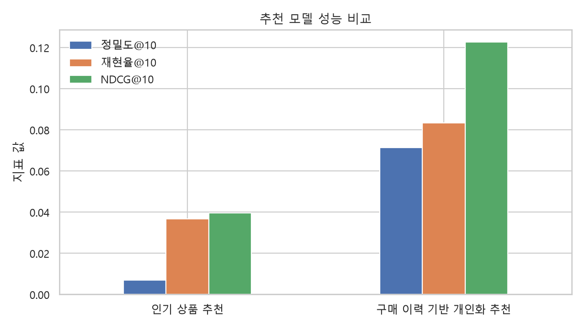
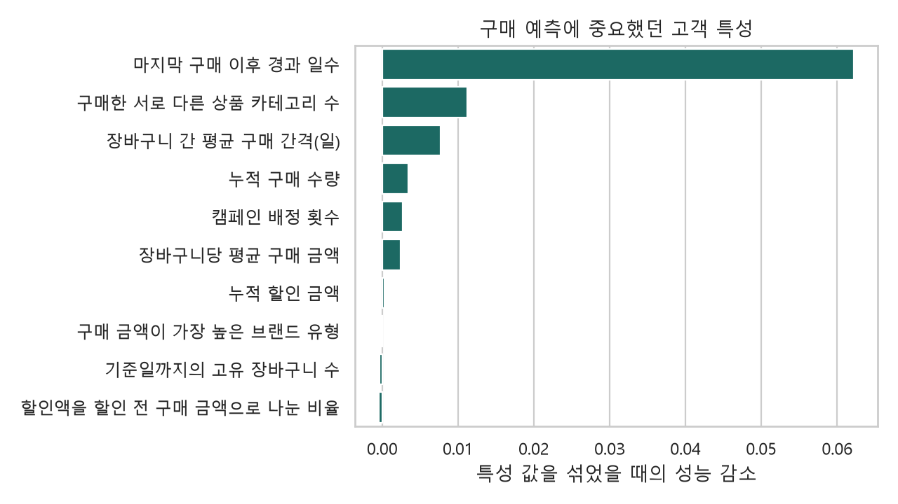

# 리테일 고객 인텔리전스 | 프로젝트 사례

[시각화 포트폴리오 사이트](https://amyhong0.github.io/retail-customer-intelligence/)에서 사용 데이터·데이터 준비와 정제·고객 특성·추천 모델 비교·28일 구매 예측·분석 결과와 인사이트·구현 구조를 확인할 수 있습니다.

dunnhumby 공식 공개 데이터 `The Complete Journey`의 원본 CSV를 분석해 고객 특성, 상품 추천, 28일 구매 예측으로 연결한 리테일 데이터 사이언스 프로젝트입니다. 공식 배포 CSV 분석 · 공통 기준일 DAY 683 · 난수 시드 42를 적용하였으며, 거래 2,595,732행에서 정제 후 2,581,266행·고객 2,500명의 구매 기록을 사용했습니다.

---

## 01 / 사용 데이터

dunnhumby의 [The Complete Journey](https://www.dunnhumby.com/source-files/)를 사용했습니다. 한 리테일러를 자주 이용하는 고객 2,500명의 약 2년 구매 기록입니다.

| 파일 | 원본 규모 | 사용한 내용 |
|---|---:|---|
| `transaction_data.csv` | 2,595,732행 | 구매 활동과 할인 행동, 추천 구성, 평가 기간의 실제 구매 확인 |
| `product.csv` | 92,353상품 | 카테고리와 브랜드 유형을 거래에 연결해 고객 선호 계산 |
| `hh_demographic.csv` | 801고객 | 고객 정보의 제공 범위 확인. 예측 모델에는 사용하지 않음 |
| `campaign_table.csv` | 7,208배정 | 기준일까지 고객에게 배정된 캠페인 수 계산 |
| `campaign_desc.csv` | 캠페인 기간 정보 | 캠페인 시작일을 연결해 기준일까지 시작된 배정만 사용 |

거래·상품·고객·캠페인 정보를 연결했습니다. 원본 CSV는 저장소에 포함하지 않으며, [다운로드 안내](data/README.md)와 `download_data.py`를 제공합니다.

---

## 02 / 데이터 준비와 정제

구매 기록을 정리하고 상품 정보를 연결했습니다. 열 이름·자료형을 통일하고, 유효한 구매를 남긴 뒤 상품 정보를 결합했습니다.

- **열 이름과 자료형 통일:** 대문자 열 이름을 소문자로 통일하고 `RETAIL_DISC`를 할인 금액 열로 이름을 바꿨습니다.
- **분석할 구매 기록 선택:** 구매 수량이 0보다 크고 판매 금액이 0 이상인 유효 기록만 남겼습니다. 정확히 중복된 행은 한 번만 남겼습니다.
- **시간 정보 보존:** `DAY`는 상대 일수(DAY 1–711)입니다. 임의의 날짜를 붙이지 않고, 실제 요일을 확인할 수 없는 주말 비율은 이번 모델에서 제외했습니다.
- **규모:** 상품 파일 92,353개 중 정제 거래에 등장한 상품은 92,015개이며, 정제 후 거래 2,581,266행·고객 2,500명을 분석했습니다.

---

## 03 / 고객 특성

DAY 683까지의 거래와 시작된 캠페인 배정으로 고객 2,500명의 특성을 계산했습니다. 구매 빈도와 지출을 넘어 선호와 구매 리듬을 정리했습니다.

- **최근 구매·구매 횟수·지출액 (RFM):** 최근 구매 이후 경과 일수, 주문 횟수, 누적 지출액을 계산했습니다. 평균 주문 금액도 함께 계산했습니다.
- **선호와 다양성:** 선호 카테고리·선호 브랜드와 구매한 카테고리 수를 계산했습니다. 구매 예측 모델과 고객 그룹 분석에 사용했습니다.
- **구매 리듬과 할인 반응:** 평균 구매 간격, 할인 전 구매 금액 대비 할인 금액 비율, 기준일까지 배정된 캠페인 수를 계산했습니다.
- **고객 특성 정의·관리:** 총 12개 특성을 계산했습니다. 고객 2,500명의 특성은 `outputs/customer_features_sample.csv`, 정의·갱신 주기는 `outputs/feature_dictionary.csv`에 저장했습니다. 누적 구매 수량과 누적 할인 금액도 포함됩니다.

---

## 04 / 학습과 평가 분리

### DAY 683까지 학습하고 이후 28일의 구매로 평가했습니다

DAY 1–683의 기록으로 고객 특성과 모델을 만들고, DAY 684–711(28일)의 실제 구매 기록으로 결과를 평가했습니다.

- **추천 평가:** 모든 고객의 DAY 683까지의 거래로 모델을 구성했습니다. 기준일 이후 첫 구매일의 실제 구매 상품으로 추천을 평가하며 재구매 상품도 후보에 포함합니다. 후보 1,000개 상품은 평가 기간 거래 기록의 33.8%를 차지하며, 후보 밖 상품도 정답에 포함했습니다. 평가 대상은 이후 첫 구매일이 확인된 고객 2,012명입니다.
- **구매 예측 평가:** 기준일까지 계산한 고객 특성으로 이후 28일 구매 여부를 예측했습니다. 고객 2,500명을 구매 고객 비율이 비슷하도록 학습용 75%와 검증용 25%로 나눴습니다.

---

## 05 / 추천 모델 비교: 인기 상품 추천 vs 구매 이력 기반 개인화 추천

동일한 학습 거래의 구매 수량 상위 1,000상품에서 두 모델을 비교했습니다. 고객 2,012명의 이후 첫 구매일 상품 전체를 정답으로 사용했습니다.

### 모델 구성 방식
1. **인기 상품 추천 (기준선):**
   - 과거(DAY 1–683)에 많이 팔린 상품의 구매 수량을 합산하여 순위를 매긴 후, 모든 고객에게 동일하게 상위 10개 상품을 추천합니다.
2. **구매 이력 기반 개인화 추천:**
   - 고객×상품 행렬을 만들고 거래별 $\log(1+\text{구매 수량})$을 고객·상품별로 합산했습니다.
   - 상품 열 사이의 코사인 유사도를 계산해 패턴이 비슷한 상품을 찾았습니다.
   - 고객의 구매 행렬과 상품 유사도 행렬을 곱해 점수를 구하고 개인별 상위 10개 상품을 추천했습니다. (재구매 상품 포함)

### 모델 지표 비교
- **NDCG@10:** 구매 이력 기반 개인화 추천 **0.1227** vs 인기 상품 추천 **0.0396** (**+209.8% 상대 개선**)
  - 실제 구매한 상품이 추천 10개 목록의 위쪽에 더 많이 나타났습니다.
- **Recall@10:** **0.0367**에서 **0.0834**로 상승
- **Precision@10:** **0.0070**에서 **0.0714**로 상승
- **평가 방식:** 학습 기간 이후 첫 구매일의 실제 구매 상품과 추천 10개를 비교했습니다. 실제 고객에게 추천을 노출한 실험이 아니라 과거 구매 기록으로 평가한 결과입니다.

NDCG@10은 실제 구매 상품을 높은 순위에 추천했는지, Recall@10은 실제 구매 상품 중 추천 목록에 포함된 비율, Precision@10은 추천 10개 중 실제 구매와 일치한 비율을 나타냅니다. 모두 고객별 점수의 평균입니다.



---

## 06 / 28일 구매 예측 (HistGradientBoosting)

고객 특성으로 다음 28일의 구매 여부를 예측했습니다. 학습에 사용하지 않은 검증 고객(25%)으로 성능과 각 특성의 중요도를 확인했습니다.

- **사용 모델:** `scikit-learn`의 `HistGradientBoostingClassifier`
- **학습 설정:** 최대 160회 반복, 학습률 0.06, 트리마다 최대 끝 노드 15개, 난수 시드 42
- **전처리:** 결측값을 채운 뒤 범주형 특성을 숫자로 변환
- **예측 성능:**
  - **ROC-AUC: 0.8355 (0.836)** — 구매 고객을 비구매 고객보다 높은 점수로 구분하는 능력
  - **평균 정밀도: 0.9510 (0.951)** — 구매 가능성 순위의 정확성을 나타내는 지표입니다. 학습에 사용하지 않은 고객의 구매 여부로 평가했습니다.
- **고객 특성 중요도 (Permutation Importance):**
  - 각 특성의 값을 무작위로 섞어 예측 성능이 얼마나 낮아지는지 측정했습니다.
  - **1위: 최근 구매 이후 경과 일수 (성능 하락 폭 0.0622)** — 구매 예측에 가장 중요한 정보
  - **2위: 구매한 카테고리 수 (0.0112)**
  - **3위: 평균 구매 간격 (0.0077)**



---

## 07 / 분석 결과와 인사이트

데이터에서 관찰한 모델 결과를 정리했습니다.

1. **구매 이력을 반영한 추천이 더 정확했습니다:**
   개인화 모델(구매 이력 기반 개인화 추천)의 NDCG@10은 인기 상품 추천 대비 209.8% 높았고, Recall@10은 0.0367에서 0.0834로 향상되었습니다.
2. **최근 구매 시점이 구매 예측에 가장 중요했습니다:**
   최근 구매 이후 경과 일수의 값을 섞었을 때 성능이 가장 크게 낮아졌으며, 구매한 카테고리 수와 평균 구매 간격도 핵심 예측 요인이었습니다.
3. **고객 특성으로 이후 28일 구매 여부를 예측했습니다:**
   12개 고객 특성으로 구매 여부를 예측했습니다. 학습에 사용하지 않은 고객의 ROC-AUC는 0.836, 평균 정밀도는 0.951이었습니다.

---

## 08 / 프로젝트 구조 및 구현 아키텍처

Python 실행 스크립트가 CSV를 불러와 정제한 뒤, 추천 모델과 구매 예측 모델을 실행하고 결과를 저장합니다.

```text
거래·상품·고객·캠페인 CSV
          ↓
data.py: 로딩·정제
          ↓
run_analysis.py: 분석 실행
          ├─ recommender.py: 구매 행렬·상품 유사도로 추천 비교
          └─ features.py → prediction.py: 고객 특성으로 구매 예측
          ↓
outputs/: 지표·고객 특성·그래프·학습 모델 저장
```

```text
retail-customer-intelligence/
├─ README.md                프로젝트 설명
├─ requirements.txt         실행 환경
├─ download_data.py         공식 데이터 다운로드
├─ run_analysis.py          전체 분석 실행 스크립트
├─ data/
│  ├─ README.md             데이터 준비 안내 및 출처
│  └─ raw/                  원본 CSV 위치 (다운로드 출처 제공)
├─ src/
│  ├─ data.py               데이터 로딩·정제
│  ├─ features.py           시점 기준 고객 특성 생성
│  ├─ recommender.py        인기 상품 추천과 구매 이력 기반 개인화 추천 비교
│  └─ prediction.py         28일 구매 예측과 고객 특성 중요도
├─ tests/                   고객 특성 계산 기준일 및 추천 지표 단위 검증
├─ outputs/
│  ├─ summary.json          데이터 규모와 전체 분석 지표
│  ├─ recommendation_metrics.csv  두 추천 모델의 평가 지표
│  ├─ feature_dictionary.csv 고객 특성 정의 및 갱신 주기 사전
│  ├─ customer_features_sample.csv  고객 2,500명 특성 샘플
│  ├─ target_customers.csv  구매 예측 점수 상위 50명
│  ├─ target_segments.csv   고객 그룹별 점수 요약
│  ├─ feature_importance.csv 고객 특성 중요도
│  ├─ propensity_model.joblib 학습된 구매 예측 모델
│  └─ *.png                 추천 비교·특성 중요도 그래프
└─ site/dist/               GitHub Pages 시각화 포트폴리오 사이트
```

### 실행 방법

```bash
python -m venv .venv
# Windows: .venv\Scripts\activate
pip install -r requirements.txt
python download_data.py
python run_analysis.py --max-items 1000
python run_analysis.py --plots-only  # 저장된 결과로 그래프만 재생성
python -m unittest discover -s tests
```
